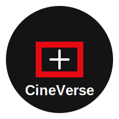

# CineVerse 🎬



CineVerse es una aplicación web moderna para explorar y descubrir películas. Construida con React, Tailwind CSS y la API de TMDB.

## 🚀 Características

- 🎯 Diseño moderno y responsivo
- 🎨 Interfaz de usuario intuitiva
- 🔍 Búsqueda avanzada de películas
- 📱 Totalmente adaptable a dispositivos móviles
- 🌙 Modo oscuro por defecto
- 🎭 Detalles completos de películas
- ⭐ Sistema de calificación

## 🛠️ Tecnologías

- React 18
- Tailwind CSS
- TMDB API
- Vite
- React Router
- React Query

## 📦 Instalación

1. Clona el repositorio:
```bash
git clone https://github.com/tu-usuario/cineverse.git
```

2. Instala las dependencias:
```bash
npm install
```

3. Crea un archivo `.env` en la raíz del proyecto:
```env
VITE_TMDB_API_KEY=tu_api_key_aqui
```

4. Inicia el servidor de desarrollo:
```bash
npm run dev
```

## 🎨 Estilos y Temas

El proyecto utiliza Tailwind CSS con una configuración personalizada que incluye:

- Paleta de colores personalizada
- Componentes reutilizables
- Sistema de diseño consistente
- Variables CSS para temas

### Variables de Color

```css
--color-primary: #E50914;    /* Rojo Netflix */
--color-secondary: #141414;  /* Fondo oscuro */
--color-dark: #000000;      /* Negro puro */
--color-light: #FFFFFF;     /* Blanco */
```

## 📱 Componentes Principales

- `MovieCard`: Tarjeta para mostrar información básica de películas
- `MovieDetails`: Vista detallada de una película
- `SearchBar`: Barra de búsqueda con autocompletado
- `Rating`: Componente de calificación interactivo

## 🤝 Contribuir

Las contribuciones son bienvenidas. Por favor, abre un issue primero para discutir los cambios que te gustaría hacer.

## 📄 Licencia

Este proyecto está bajo la Licencia MIT - ver el archivo [LICENSE.md](LICENSE.md) para más detalles.
